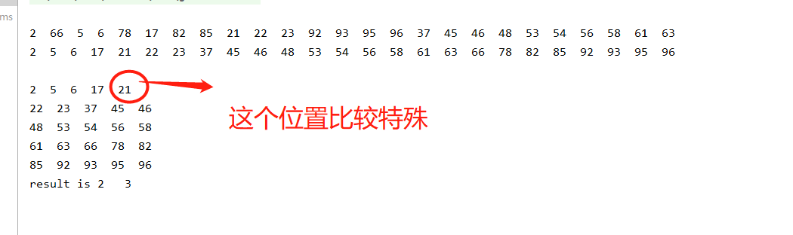

# TwoDimensionalArraySearch
## 题目
在一个二维数组中，每一行都按照从左到右递增的顺序排序，每一列都按照从上到下递增的顺序排序。请完成一个函数，输入这样的一个二维数组和一个整数，判断数组中是否含有该整数。

## 解析
题目的意思很简洁而且易懂，就是给定一个二维数组，每一行和每一列都是从小到大的排列，现在给你一个数，让判断该数是否在这个二维数组中。

## 思路
解题思路 数组构建成顺序二维矩阵以后需要查询，只需要在数据本身的空间特性上做文章就可以了。以右上角作为起点 该点左面的数据都小于它，下面的数据都大于它。根据这个特性写代码就可以

